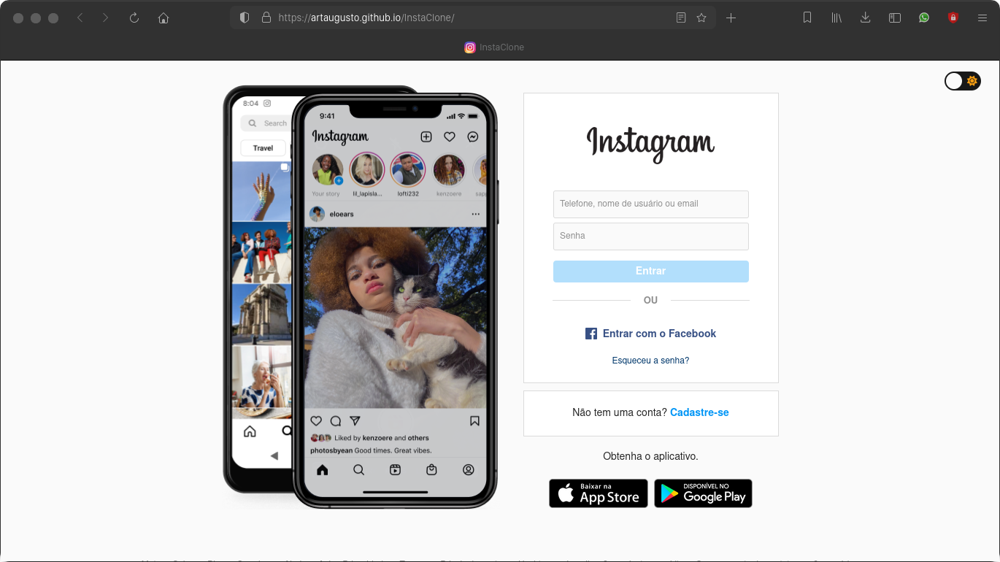
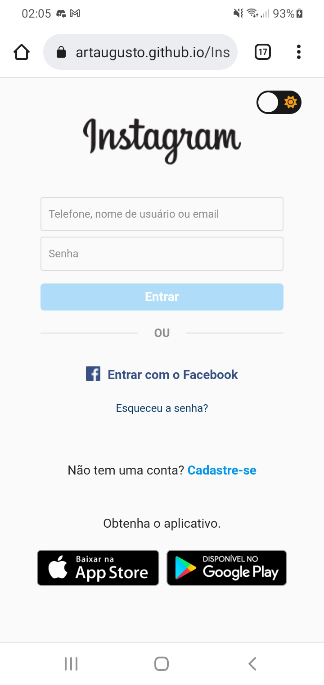
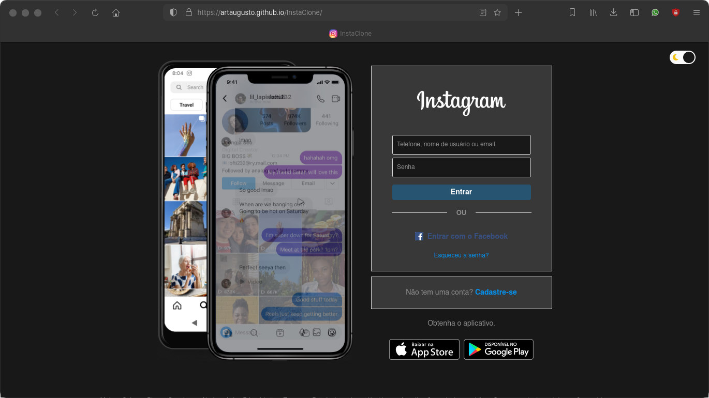
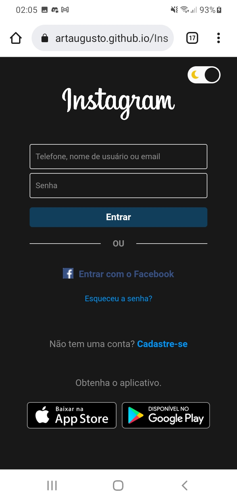

# InstaClone

> Projeto front-end de clone do Instagram que, além de simular todo o comportamento front-end da página original, inclui um switch para o dark mode.

> Teste o site:
> [InstaClone](https://artaugusto.github.io/InstaClone/)

## 📝 Licença

Esse projeto está sob licença. Veja o arquivo [LICENÇA](LICENSE) para mais detalhes.

[⬆ Voltar ao topo](#DoctorCare)
